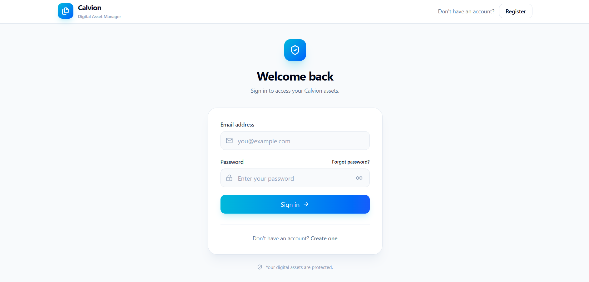
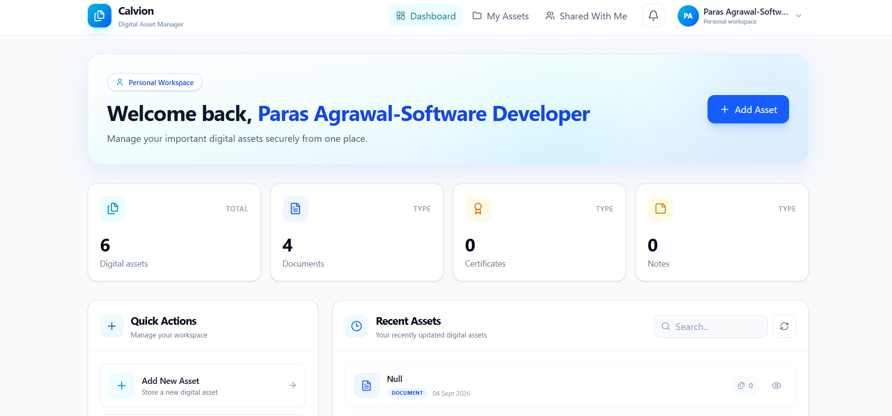
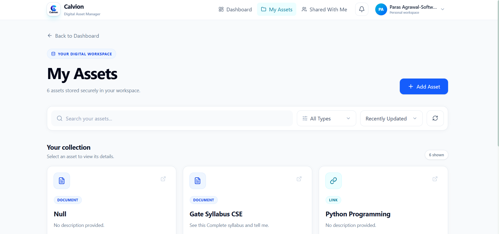
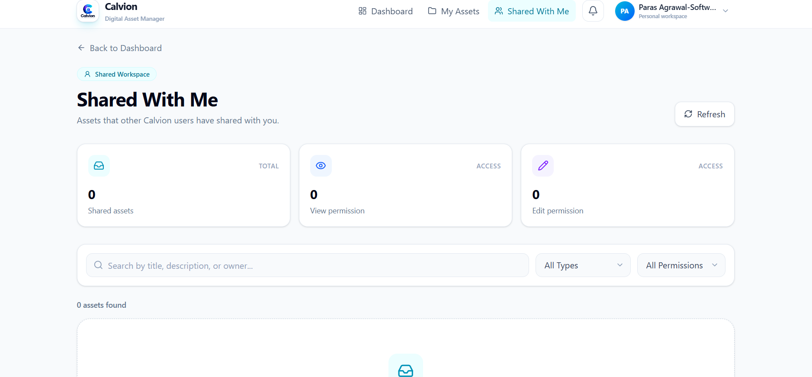
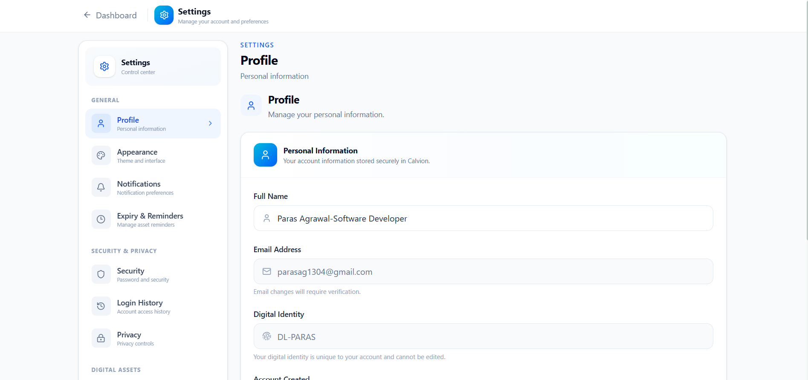
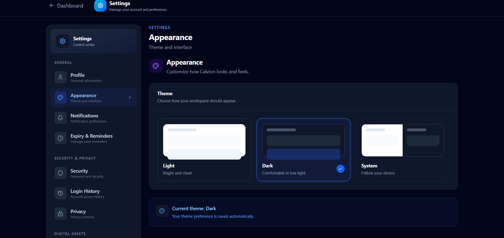

# Calvion

### Secure Digital Asset Management Platform

Calvion is a full-stack digital asset management platform designed to securely store, organize, manage, and share important digital assets from one place.

[](https://react.dev/)
[](https://www.typescriptlang.org/)
[](https://spring.io/projects/spring-boot)
[](https://www.java.com/)
[](https://www.postgresql.org/)
[](https://tailwindcss.com/)

## Features

- User registration and OTP verification
- JWT-based authentication
- Digital asset management
- Document and file uploads
- Asset sharing and permissions
- Shared With Me
- Notifications
- Activity history
- Profile management
- Password management
- Light / Dark / System theme
- Search and filtering
- Responsive UI

## Tech Stack

### Frontend
- React
- TypeScript
- Vite
- Tailwind CSS
- Axios
- React Router
- Lucide React

### Backend
- Java
- Spring Boot
- Spring Security
- JWT
- PostgreSQL
- JPA / Hibernate

## Project Structure

## Project Structure

```text
Calvion/
├── backend/
├── frontend/
├── package.json
├── package-lock.json
└── .gitignore
```
## Getting Started

### Prerequisites

Make sure you have the following installed:

- Node.js
- npm
- Java
- PostgreSQL
- IntelliJ IDEA

### Frontend Setup

```bash
cd frontend
npm install
npm run dev
```

The frontend will start using Vite.

### Backend Setup

Open the `backend` folder in IntelliJ IDEA and run the Spring Boot application.

Make sure PostgreSQL is running and the database configuration is correctly configured before starting the backend.

## Environment Variables

Keep sensitive configuration only in your local environment.

Do not commit:

- Database passwords
- JWT secrets
- API keys
- Email credentials
- Other sensitive configuration

## Application Modules

### Authentication

- User registration
- OTP verification
- Login
- Forgot password
- Password reset
- JWT authentication

### Digital Assets

- Create assets
- Edit assets
- View asset details
- Upload files
- Search assets
- Filter assets
- Manage asset types

### Sharing

- Share digital assets
- Manage permissions
- Shared With Me
- View shared asset details

### Notifications

- Notification center
- Unread notification count
- Mark notification as read
- Mark all notifications as read
- Sharing and permission notifications

### Activity History

- Asset creation history
- Asset update history
- File upload history
- Workspace activity tracking

### Settings

- Profile management
- Password management
- Appearance settings
- Light theme
- Dark theme
- System theme
- Notification preferences

## Screenshots

### Login


### Dashboard


### My Assets


### Shared With Me


### Settings


### Dark Mode


## Security

Calvion uses JWT-based authentication and Spring Security to protect authenticated resources.

Sensitive configuration such as database credentials and JWT secrets should always remain outside the public repository.

## Future Improvements

- Cloud storage integration
- Advanced search
- Two-factor authentication
- Email notification preferences
- Data export
- Asset expiry reminders
- Improved analytics
- Additional sharing controls

## Author

**Paras Agrawal**

Java Full-Stack Developer | Java | Spring Boot | React | TypeScript
